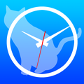

iPhone版艦これタイマー連携ツール 
======================
艦これタイマー連携ツールは  
iPhone版「[艦これタイマー](https://itunes.apple.com/jp/app/shiptimer/id684642180?l=ja&ls=1&mt=8)」に  
遠征時間を自動セットするChrome拡張です。  

## 機能概要

1. 遠征のタイマーを自動で取得し、  iPhone版艦これタイマーに自動で設定します。
1. (iPhone版艦これタイマーが)完了時間を通知します

## 用意するもの

1. **Googleアカウント**
1. Google Chrome
1. iPhoneアプリ「[艦これタイマー](https://itunes.apple.com/jp/app/shiptimer/id684642180?l=ja&ls=1&mt=8)」
1. Chrome拡張「[艦これタイマー連携ツール](https://chrome.google.com/webstore/detail/%E8%89%A6%E3%81%93%E3%82%8C%E3%82%BF%E3%82%A4%E3%83%9E%E3%83%BC%E9%80%A3%E6%90%BA%E3%83%84%E3%83%BC%E3%83%AB/nioemkhjlmohkgmkandecganpglmbhil)」

## 使い方
以下をクリックすると説明動画にジャンプします。  
  

## 免責事項という名の言い訳

- **事前通知なしにサービスを止めることがあるよ！**
    - 高負荷がかかってサーバー料金があびゃあってなったら問答無用で止めます。(自前サーバーではなくAWS使ってますので)

- **「タイマーが反映されるまでに時間がかかるぞｺﾞﾙｧ」という問い合わせについては無視します。**
    - iPhoneがバックグラウンド更新を行うには多少（5～30分）の遅延が発生する場合があります。その場合はどうしようもないので
    - 通知が遅延してる可能性もあるので、正直わかんないのです。

- **「『バックグラウンド更新ON』にしたら電池がモリモリ減るんだが！」**
    - Ingressやると良いよ！！面白いよ！比較にならないくらい電池がモリモリ減るんで、正直電池の減りとかどうでも良くなります。

- **規約違反なんじゃないのー？**
    - ゲームサーバー側に負荷をかけるわけではない実装にしていますので、問題無いとは思いますが（推奨環境のChromeですし）気になる方は使わないのが吉かと

正直、β版のままいくつもりなので生暖かい目みていただけると助かります。

## お問い合わせ/機能要望/バグ報告
- Twitterから
    - [twitter.com/Kozeni_50yen](https://twitter.com/Kozeni_50yen)
- GitHubから
    - [github.com/hkmySoft/ShipTimeForChrome/issues/new](https://github.com/hkmySoft/ShipTimeForChrome/issues/new) 

## RELEASES
- RELEASEINFO
- 2014/05/23 v0.0.1
    - GitHubにて管理開始

## 使用ソフトウェア

kanColleWidget

Copyright (c) 2014 otiai10

Permission is hereby granted, free of charge, to any person obtaining a copy
of this software and associated documentation files (the "Software"), to deal
in the Software without restriction, including without limitation the rights
to use, copy, modify, merge, publish, distribute, sublicense, and/or sell
copies of the Software, and to permit persons to whom the Software is
furnished to do so, subject to the following conditions:

The above copyright notice and this permission notice shall be included in
all copies or substantial portions of the Software.

THE SOFTWARE IS PROVIDED "AS IS", WITHOUT WARRANTY OF ANY KIND, EXPRESS OR
IMPLIED, INCLUDING BUT NOT LIMITED TO THE WARRANTIES OF MERCHANTABILITY,
FITNESS FOR A PARTICULAR PURPOSE AND NONINFRINGEMENT. IN NO EVENT SHALL THE
AUTHORS OR COPYRIGHT HOLDERS BE LIABLE FOR ANY CLAIM, DAMAGES OR OTHER
LIABILITY, WHETHER IN AN ACTION OF CONTRACT, TORT OR OTHERWISE, ARISING FROM,
OUT OF OR IN CONNECTION WITH THE SOFTWARE OR THE USE OR OTHER DEALINGS IN
THE SOFTWARE.
